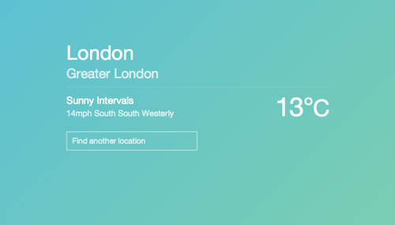

# Clear Sky 

[](https://magnum.travis-ci.com/robinjmurphy/clear-sky)

> It tells you the weather.

A project to help me learn the [Scalatra](http://www.scalatra.org) framework.



A version of the application is running at http://clear-sky.robinmurphy.co.uk/.

## Build & Run

```
./sbt
> container:start
> browse
```

If `browse` doesn't launch your browser, manually open [http://localhost:8080/](http://localhost:8080/) in your browser.

## Test

Tests are written using [ScalaTest](http://www.scalatest.org/).

```
./sbt
> test
```
